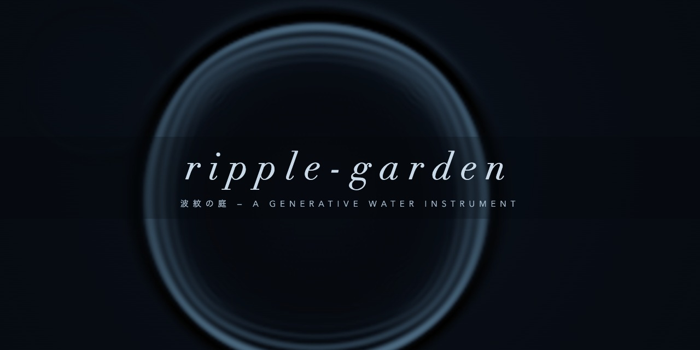

# ripple-garden — 波紋の庭

**▶ Play: https://sirop-d.github.io/ripple-garden/**

触れた水面が音と模様を生む生成楽器。
A generative water instrument. / Un instrument d'eau génératif.

---

## JPN

- 本物の2D波動方程式による水面。波紋の干渉も画面端の反射も、演出ではなく物理として現れます
- 音は波紋の出来事——着水・反射・干渉——から生まれ、触れた場所が音程・パン・コードを決めます
- 13のモード: CALM / GLASS / STORM / RESONANCE / ZEN / BOWL に、木琴・鉄琴（硬いバチ／柔らかいバチ）とピンク・ブラウン・ホワイトノイズを追加
- 10の定番コード進行: 王道・カノン・小室・丸の内・アクシス・50s・ツーファイブワン・循環・サス・マイナーナインス
- ASSIST ON は反射音まで心地よいコードへ吸着し、OFF は小さな違和感を残します。SUSTAIN で余韻を伸ばせます
- スペースキー奏法と弓奏ストローク
- 自動クルーズ: 5〜120分・∞ループ・シャッフル。長尺環境音のように流しておけます
- REC → WAV書き出し（16bitステレオ）。音楽制作の素材にどうぞ
- 単一HTML・依存ゼロ・3言語（JPN/ENG/FRA）・ライト/ダーク/システムテーマ

## ENG

- A water surface driven by the real 2D wave equation — interference and edge reflections emerge from physics, not effects
- Sound is born from the water's events (drops, reflections, interferences); where you touch sets pitch, pan and chord
- 13 modes: the original six plus hard/soft xylophone, hard/soft glockenspiel, and pink/brown/white noise
- 10 classic chord progressions, including royal road, canon, axis, 50s, ii–V–I, suspended and minor ninth
- ASSIST ON snaps even reflections toward pleasant chords; OFF leaves a little friction. SUSTAIN extends the resonance
- Spacebar play & bow strokes
- Auto-cruise: 5–120 minutes, ∞ loop, shuffle — leave it on like a long-form ambient video
- REC → 16-bit stereo WAV export, ready for music-making
- Single HTML file, zero dependencies, three languages, light/dark/system themes

## FRA

- Une surface d'eau gouvernée par la véritable équation d'onde 2D — interférences et réflexions naissent de la physique
- Le son naît des événements de l'eau (gouttes, réflexions, interférences) ; le lieu touché règle hauteur, panoramique et accord
- 13 modes : les six modes d'origine, xylophone et glockenspiel durs/doux, puis bruits rose/brun/blanc
- 10 progressions d'accords classiques, dont canon, axis, années 50, ii–V–I, suspendue et neuvième mineure
- ASSIST ON accorde même les réflexions vers des accords agréables ; OFF conserve un peu de friction. SUSTAIN prolonge la résonance
- Jeu à la barre d'espace et coups d'archet
- Croisière automatique : 5–120 minutes, boucle ∞, aléatoire — à laisser tourner comme une vidéo ambiante
- REC → export WAV stéréo 16 bits
- Fichier HTML unique, zéro dépendance, trois langues, thèmes clair/sombre/système

---

## credits

by **sirop** — co-created with AI agents (built with Claude).
License: [MIT](LICENSE)
